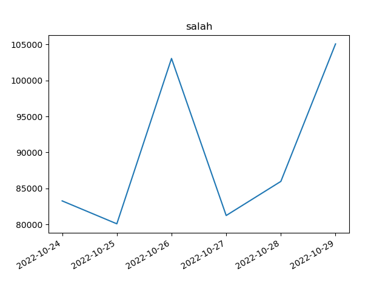

# Twitter Trends Analyser &nbsp;  

## Introduction

This python script helps you analyse the level of engagement of people with a certain topic by plotting a graph of the number of tweets containing the given keywords for each day since a given date. The script uses the python twitter API wrapper `tweepy` to fetch the data and `matplotlib` to graph it.

## Installation

Open the terminal and run the following commands

```
sudo apt install python3 pip
pip install python-dotenv
```

## Instructions

Clone this repository by openning the terminal and run the following command

```
git clone https://github.com/elgamalsalman/twitter-trends-analyser
```

Then you need to create and fill the .env file with your personal twitter developer account information

```
cp /twitter-trends-analyser/template.env /twitter-trends-analyser/.env
nano /twitter-trends-analyser/.env
```

The `twitter-trends-analyser` takes no command-line arguments, however it will ask the user for input.

In order to run the script run the following command

```
python3 /twitter-trends-analyser/src/twitter-trends-analyser.py
```

## Code in Action!

This is a sample run querying the number of tweets about the famous Egyptian football player Mohamed Salah who plays in liverpool football club, the query is from the 24th of October 2022 to the 29th of the same month.

This is the input given to `twitter-trends-analyser`

```
input the keywords to look for seperated by spaces: salah
input the start time (YYYY-MM-DD): 2022-10-24
input the name of the file to save the plot to: salah.png
```

and this is the resulting plot

<p align="center">
	
</p>

Notice the peaks on the 26th and the 29th, these agree with real world data as liverpool football club had matches on both of these days.
